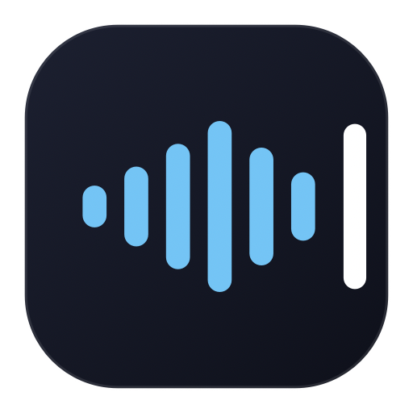

<div align="center">



# Katip

**macOS için tamamen yerel çalışan sesli dikte.**
Türkçe konuş, içine İngilizce teknik terim serpiştir — imlecin olduğu yere yazsın.

[](https://github.com/mehmetvarol/katip/releases/latest)
[](#)
[](#)
[](#)
[](LICENSE)

</div>

---

Amaç **vibe coding**: Claude Code / Cursor gibi ajanlara klavyeyle uzun prompt
yazmak yerine konuşarak prompt vermek. Konuşma Türkçe, içine İngilizce teknik
terimler serpiştirilmiş oluyor ("şu `component`'i `refactor` edelim") — bu
karışık dil durumu için Whisper tabanlı bir motor kullanıyor.

- 🎤 Menü çubuğu ikonu · atanabilir global kısayol · bas-tut ve çift-bas-kilit
- 〰️ Masaüstünde yüzen kart: canlı ses dalgası, kenara yapışma
- 🔒 Kilit modunda **akan çeviri**, tek seferde yazma
- 📴 Bulut yok, abonelik yok, ses cihazdan çıkmıyor
- ⚡ ~0.43× gerçek zaman (M1 Pro, Metal) — 5 sn konuşma ~2.2 sn'de yazıya döner

## Kurulum

Katip **notarize edilmiş bir binary dağıtmıyor** — Apple Developer Program
üyeliği (99 $/yıl) gerektirmeden açık kaynak kalmak için.

**İndir (en basit):**
[Katip.zip'i indir](https://github.com/mehmetvarol/katip/releases/latest) →
çıkar → `Katip.app`'i Uygulamalar klasörüne sürükle.

**Homebrew ile:**
```bash
brew install --HEAD mehmetvarol/katip/katip
rm -rf /Applications/Katip.app && cp -R "$(brew --prefix katip)/Katip.app" /Applications/Katip.app
```

**Doğrudan (kaynaktan):**
```bash
git clone https://github.com/mehmetvarol/katip.git && cd katip/app && ./build.sh --run
```

İndirilen zip ve Homebrew **ad-hoc imzalı** (kimliksiz) — her güncellemede
Mikrofon, Erişilebilirlik ve Giriş İzleme izinlerini yeniden vermen gerekir.
Kaynaktan derleme farklı: kendi Apple Development kimliğin varsa (ücretsiz,
Xcode ile otomatik oluşur) `build.sh` onu buluyor ve imza derlemeler arası
SABİT kalıyor — izinler bir daha düşmez.

> [!warning] İlk çalıştırmada Gatekeeper engelleyecek
> **Sistem Ayarları → Gizlilik ve Güvenlik → aşağı kaydır → "Yine de Aç"**
> (Bu düğme ilk denemeden sonra ~1 saat görünür kalır.)

Kendi Apple Developer Program kimliğin varsa kalıcı izin için:
```bash
KATIP_SIGN_ID="Developer ID Application: Ad Soyad (TEAMID)" ./app/build.sh --run
```

## Kullanım

| Jest | Ne olur |
|---|---|
| İkona **sol tık** | Dinlemeye başlar · tekrar tık → yazıya çevirir |
| Kısayola **basılı tut** | Bas-konuş |
| Kısayola **çift bas** | 🔒 Kilit modu: elini çek, sürekli dinler · tuşa bas → bitir |
| İkona **sağ tık** | Menü (kısayol, sözlük, geçmiş, ayarlar) |

Kısayol tuşu menüden seçilir (varsayılan **Sağ Option**): sağ tık → "Kısayol tuşu".

İlk çalıştırmada üç izin istenir — **Mikrofon**, **Erişilebilirlik** (metnin
imlece yazılması için) ve **Giriş İzleme** (kısayol tuşu için), ayrıca ~1.6 GB
model iner. Durumu izlemek için:
```bash
tail -f ~/Library/Application\ Support/Katip/katip.log
```

## Yüzen kart

Masaüstünde duran, şekil değiştiren bir gösterge — boşta ince bir çizgi,
fareyle üstüne gelince iki düğmeye açılır (dil, mikrofon), konuşurken
ses seviyesine tepki veren bir dalgayla genişler. Sürükleyip savurabilirsin —
fizik tabanlı hareket kenara yapışır, ekran dışına asla tamamen çıkmaz.

## Diğer özellikler

- **Geçmiş** (sağ tık → Geçmiş…) — aranabilir, 30 gün sonra otomatik silinir
- **Yeniden çevir** — çeviri kötü çıktıysa geçmiş penceresinden aynı sesi
  tekrar çevirtebilirsin. Canlı diktenin aksine ses parçalanmadan tek seferde
  gidiyor, yani modele bütün bağlam birden veriliyor
- **Sözlük** — sık bozulan teknik terimler için Whisper'a ipucu (varsayılan
  açık, 10 terim); kendi terimlerini `glossary.txt`'e ekleyebilirsin
- **Çoklu dil seçimi** — kartın küre ikonu birden fazla dili aynı anda
  işaretlemene izin verir; Katip her dili ayrı ayrı dener ve en güvenilir
  sonucu seçer
- **Uygulama-bazlı kurallar** — dikte dili ve sözlük, odaktaki uygulamaya göre
  otomatik değişir (ör. Cursor'da TR+EN sözlük açık, Slack'te sadece TR
  sözlük kapalı); `app-profiles.txt`'te düzenlenir
- **Metin kısayolları** — söylediğin bir ifade hazır bir metin bloğuna genişler
- **Projelerinden terim öğrenme** — `package.json` bağımlılıklarını tarayıp
  telaffuz kurallarını önerir (`Katip --learn ~/Desktop`)
- **Girişte başlat** (sağ tık → Girişte başlat)

Ayarlar düz metin dosyaları olarak `~/Library/Application Support/Katip/` altında:

| Dosya | Ne işe yarar |
|---|---|
| `glossary.txt` | Whisper'a terim ipucu (bütçe 40 token, kritik terimleri sona yaz) |
| `replacements.txt` | `yanlış = doğru` düzeltme kuralları |
| `snippets.txt` | `tetikleyici = uzun metin` kısayolları |
| `app-profiles.txt` | Uygulama adına göre dikte dili + sözlük kuralı |
| `history.jsonl` | Dikte geçmişi (düz metin, 30 gün) |
| `recordings/` | Son 20 diktenin **ham sesi** — "Yeniden çevir" bunu kullanıyor |
| `katip.log` | Çalışma zamanı günlüğü |

> Sesin `recordings/` altında duruyor. Son 20 kayıtla sınırlı ve geçmiş
> penceresindeki **Sesleri sil** ile tamamen silinebilir. Hiçbir yere
> gönderilmiyor — bu uygulamada ağ trafiği yok.

## Gereksinimler

- macOS 14+ (Sonoma)
- Homebrew veya Xcode Command Line Tools (derleme için)

---

Geliştirme kararları, ölçümler ve motor seçimi için proje geçmişine bakılabilir.
